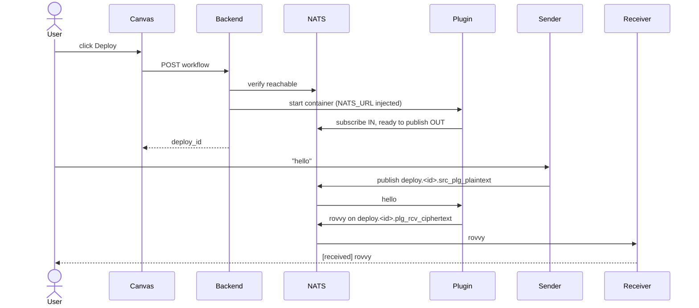

# Demo flow

```mermaid
sequenceDiagram
    actor U as User
    participant C as Canvas
    participant B as Backend
    participant N as NATS
    participant P as Plugin
    participant S as Sender
    participant R as Receiver

    U->>C: click Deploy
    C->>B: POST workflow
    B->>N: verify reachable
    B->>P: start container (NATS_URL injected)
    P->>N: subscribe IN, ready to publish OUT
    B-->>C: deploy_id

    U->>S: "hello"
    S->>N: publish deploy.<id>.src_plg_plaintext
    N->>P: hello
    P->>N: rovvy on deploy.<id>.plg_rcv_ciphertext
    N->>R: rovvy
    R-->>U: [received] rovvy
```
