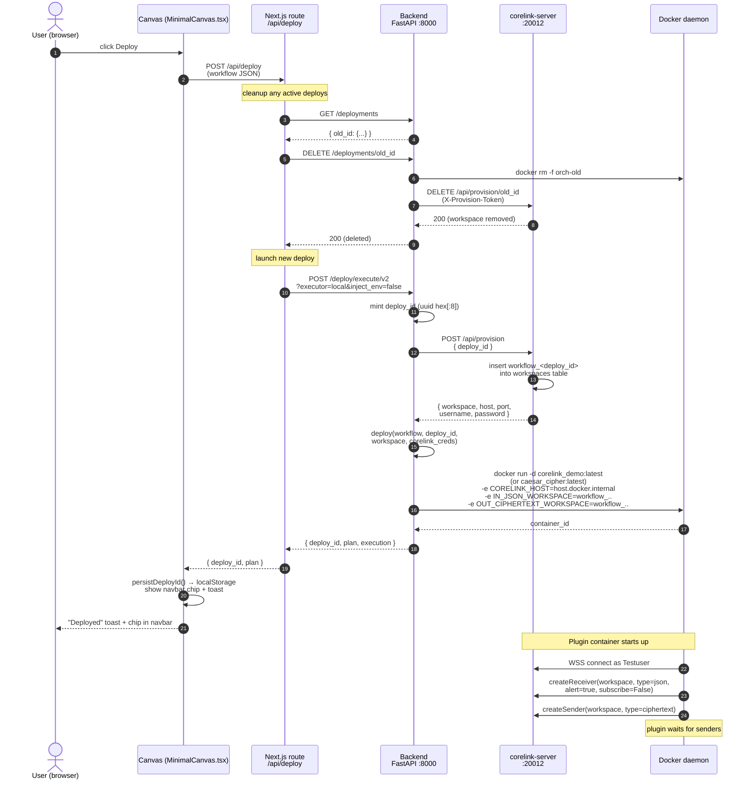

# Demo flow: from canvas Deploy to receiver receiving "rovvy"

End-to-end sequence for the corelink-modular demo. Two phases:
- **Phase 1 — Deploy** (clicking Deploy on the canvas): provisions a Corelink workspace and starts the plugin container.
- **Phase 2 — Message** (running sender + receiver, typing `hello`): wires the live data flow through the plugin.

## Phase 1 — Deploy

## Phase 2 — Message

```mermaid
sequenceDiagram
    autonumber
    actor Op as Operator
    participant Sender as sender.js
    participant Receiver as receiver.js
    participant BE as Backend
    participant CL as corelink-server
    participant Plugin as Plugin container<br/>(caesar_cipher)

    Note over Op: terminal A: bash run-receiver.sh <id>
    Op->>Receiver: launch
    Receiver->>BE: GET /deployments/<id>/credentials?role=receiver
    BE-->>Receiver: { corelink: { host, port, user=Testuser2 },<br/>credentials: { ciphertext: { workspace, ... } } }
    Receiver->>CL: WSS connect as Testuser2
    Receiver->>CL: createReceiver(workspace, type=ciphertext,<br/>alert=true)
    CL-->>Receiver: streamList of existing senders
    Note over Receiver: subscribe to plugin's CIPHERTEXT sender<br/>(Set-deduped)
    Receiver->>CL: subscribe({streamIDs: [plugin_sid]})
    Note over Receiver: parked, listening

    Note over Op: terminal B: bash run-sender.sh <id>
    Op->>Sender: launch
    Sender->>BE: GET /deployments/<id>/credentials?role=sender
    BE-->>Sender: { corelink: { user=Testuser1 },<br/>credentials: { json: {...} } }
    Sender->>CL: WSS connect as Testuser1
    Sender->>CL: createSender(workspace, type=json)
    CL->>Plugin: function:update<br/>(new sender on type=json)
    Plugin->>Plugin: _on_stream_update fires<br/>(dedupe-checked)
    Plugin->>CL: subscribe_to_stream(rid, sender_sid)

    Op->>Sender: type "hello"<br/>+ Enter
    Sender->>CL: send(buffer "hello")
    CL->>Plugin: relay "hello" to receiver_sid
    Plugin->>Plugin: _on_data → _transform → "rovvy"
    Plugin->>CL: send(plugin_sid, "rovvy")
    CL->>Receiver: relay "rovvy" to receiver_sid
    Receiver->>Op: console.log("[received] rovvy")
```

## Key invariants

- **One workspace per deploy** (`workflow_<deploy_id>`), created by corelink-server's `/api/provision` route.
- **Three distinct corelink users** to dodge same-user notification suppression: sender→Testuser1, receiver→Testuser2, plugin→Testuser.
- **Two stream types** flow through the same workspace: `json` (sender→plugin) and `ciphertext` (plugin→receiver). Different types prevent the receiver from accidentally subscribing to the sender's raw stream.
- **Subscribe dedup** on both sides: plugin's `_subscribed_pairs` set + JS receiver's `Set` of subscribed streamIDs. Each (receiver, sender) pair gets exactly one server-side subscription, exactly one delivery per published message.
- **Cleanup is idempotent**: every canvas Deploy DELETEs prior deploys first, every executor stop is `docker rm -f`, every workspace removal is 200/404-tolerant on the corelink-server side.

## Files involved per step

| Step | File |
|---|---|
| Click Deploy | `frontend/components/canvas/MinimalCanvas.tsx` (handleDeploy) |
| Frontend route | `frontend/app/api/deploy/route.ts` |
| Backend deploy endpoint | `backend/main.py` (`/deploy/execute/v2`) |
| Provisioning client | `backend/corelink_admin.py` (`provision_deployment`) |
| Provisioning route | `corelink-server/corelink.js` (`handleProvision`) |
| Planner | `backend/deployment.py` (`deploy()`) |
| Container start | `backend/executors/local.py` (`LocalDockerExecutor.start`) |
| Plugin entry | `plugins/caesar_cipher/main.py` |
| Sender CLI | `scripts/sender.js` + `scripts/lib/corelink-transport.js` |
| Receiver CLI | `scripts/receiver.js` + `scripts/lib/corelink-transport.js` |
| Vendored client | `scripts/lib/vendor/corelink.lib.js` |
