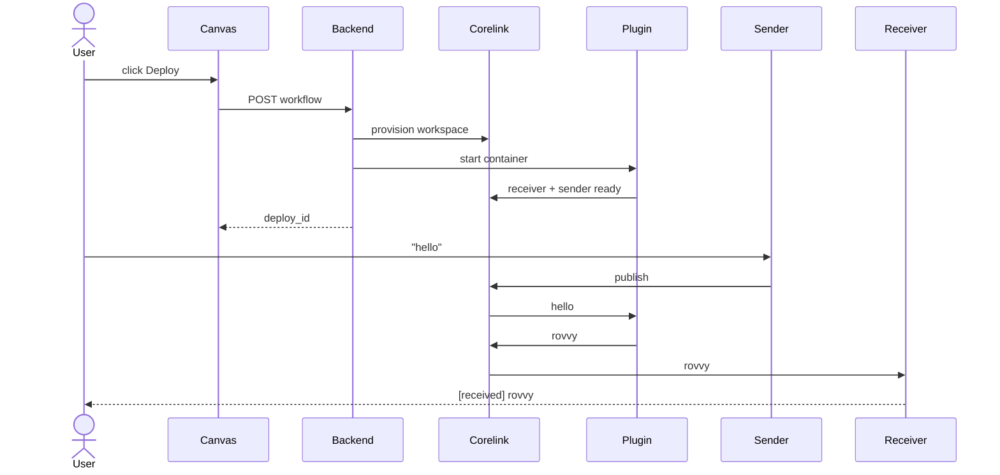

# Demo flow

```mermaid
sequenceDiagram
    actor U as User
    participant C as Canvas
    participant B as Backend
    participant CL as Corelink
    participant P as Plugin
    participant S as Sender
    participant R as Receiver

    U->>C: click Deploy
    C->>B: POST workflow
    B->>CL: provision workspace
    B->>P: start container
    P->>CL: receiver + sender ready
    B-->>C: deploy_id

    U->>S: "hello"
    S->>CL: publish
    CL->>P: hello
    P->>CL: rovvy
    CL->>R: rovvy
    R-->>U: [received] rovvy
```
